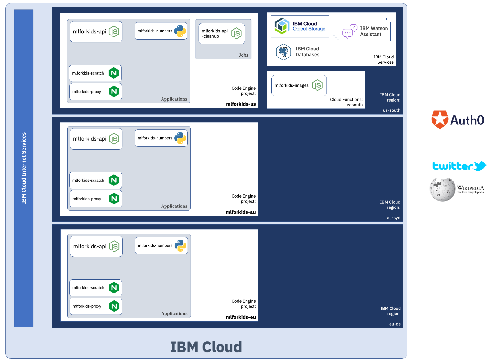
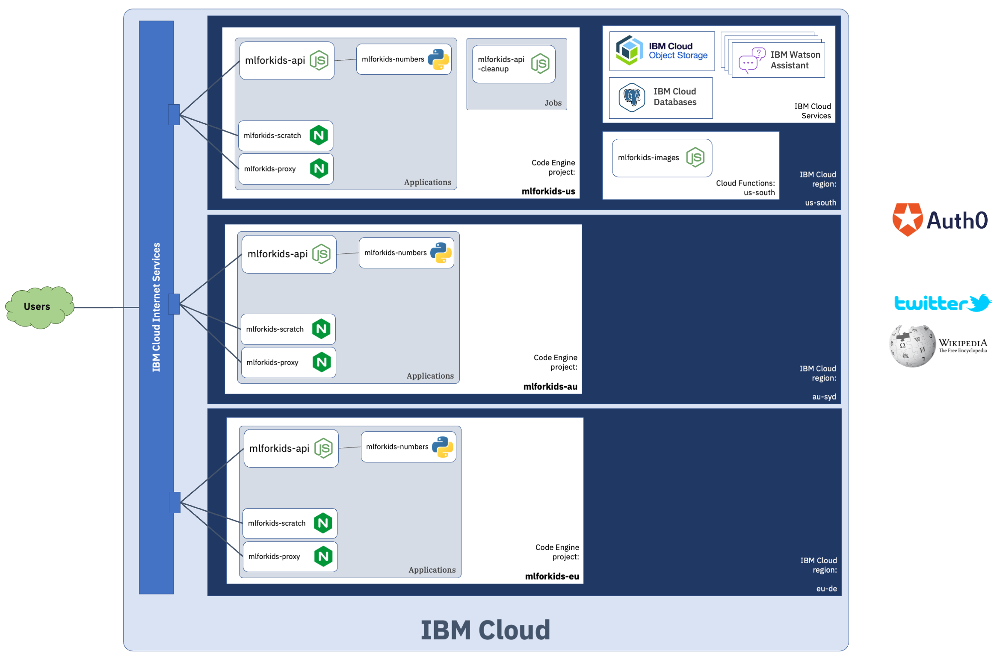
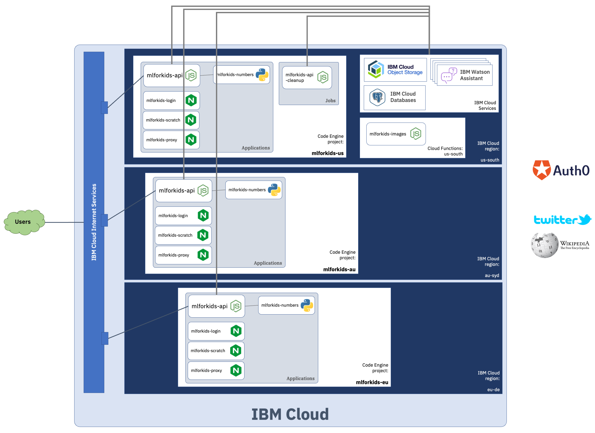
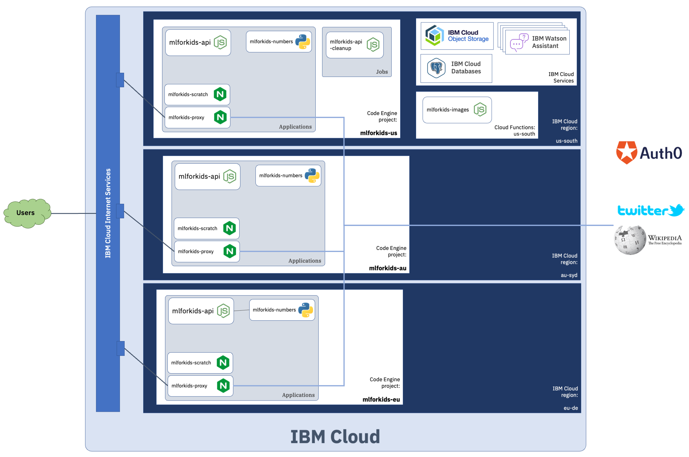

# Machine Learning for Kids production deployment

The Machine Learning for Kids site is made up of a few different pieces. This document is here to describe what they all are and where they go.

- [The bits that make up the site](#the-bits-that-make-up-the-site)
- [Where HTTP requests go](#where-http-requests-go)
- [Where data lives](#where-data-lives)
- [Where users are authenticated](#where-users-are-authenticated)
- [Where third-party APIs are accessed](#where-third-party-apis-are-accessed)

---
## The bits that make up the site

An (almost) complete set of components that makes up the Machine Learning for Kids platform is deployed into three separate regions.

| **Component**         | **Source code**                              | **Docker image**                                                                  | **Language** | **Deployment approach** | **Purpose** |
| --------------------- | -------------------------------------------- | --------------------------------------------------------------------------------- | ------------ | ----------------------- | ----------- |
| mlforkids-api         | [`./mlforkids-api`](./mlforkids-api)         | [dalelane/mlforkids-api](https://hub.docker.com/r/dalelane/mlforkids-api)         | Node.js      | k8s Deployment (in Code Engine) | Main website and API              |
| mlforkids-numbers     | [`./mlforkids-numbers`](./mlforkids-numbers) | [dalelane/mlforkids-numbers](https://hub.docker.com/r/dalelane/mlforkids-numbers) | Python       | k8s Deployment (in Code Engine) | Creates ML models and visualisations for numbers projects |
| mlforkids-scratch     | [`./mlforkids-scratch`](./mlforkids-scratch) | [dalelane/mlforkids-scratch](https://hub.docker.com/r/dalelane/mlforkids-scratch) | nginx        | k8s Deployment (in Code Engine) | Hosts static parts of website that don't change frequently (i.e. Scratch fork) |
| mlforkids-proxy       | [`./mlforkids-proxy`](./mlforkids-proxy)     | [dalelane/mlforkids-proxy](https://hub.docker.com/r/dalelane/mlforkids-proxy)     | nginx        | k8s Deployment (in Code Engine) | Proxies requests from Scratch to external third-party APIs |
| mlforkids-images      | [`./mlforkids-images`](./mlforkids-images)   | n/a                                                                               | Node.js      | OpenWhisk Function      | Image pre-processing (e.g. resizing, converting, etc.) |
| mlforkids-api-cleanup | [`./mlforkids-api`](./mlforkids-api)         | [dalelane/mlforkids-api](https://hub.docker.com/r/dalelane/mlforkids-api)         | Node.js      | k8s Job (in Code Engine) | Periodic job (cron triggered every hour) to cleanup redundant data in Cloud Object Storage, and delete expired users and Watson Assistant workspaces |

---
## Where HTTP requests go

Components with external (Internet-facing) HTTP endpoints are:
- mlforkids-api
- mlforkids-scratch
- mlforkids-proxies

An instance of [Cloud Internet Services](https://www.ibm.com/cloud/cloud-internet-services) performs DNS routing - routing HTTP requests to the instance in their nearest region. (*It also manages the certificate for the machinelearningforkids.co.uk domain and performs TLS termination.*)

| **url**                              | **routed to**     | **notes** |
| ------------------------------------ | ----------------- | --------- |
| scratch.machinelearningforkids.co.uk | mlforkids-scratch | *caching means most requests are  served immediately from Cloud Internet Services layer* |
| proxy.machinelearningforkids.co.uk   | mlforkids-proxies |
| machinelearningforkids.co.uk         | mlforkids-api     |

*The HTTP endpoint provided by **mlforkids-numbers** is only accessible within the namespace where it is running, and is only called by the **mlforkids-api** instance in the same region as it.*

*This is described in [Deploying an application across multiple regions with a custom domain name](https://cloud.ibm.com/docs/codeengine?topic=codeengine-deploy-multiple-regions) in the Code Engine documentation.*

---
## Where data lives

Data is stored in:
- PostgreSQL database provided by [IBM Cloud Databases](https://www.ibm.com/cloud/databases) (for data relating to student ML projects)
- [Cloud Object Storage](https://www.ibm.com/cloud/object-storage) bucket for storing training data for image and sound ML projects

These are both hosted in the us-south region (this means that instances of the **mlforkids-api** application and **mlforkids-api-cleanup** job in every region all connect to storage in us-south region).

*Similarly, instances of Watson Assistant workspaces that are used to support text projects are created in the us-south region.*

---
## Where users are authenticated

Authentication is provided by a third-party service, [Auth0](https://auth0.com).

Back-end/API authentication is handled by the **mlforkids-api** service, which makes requests directly to Auth0 APIs using express middleware.

Web authentication is handled through Auth0.

---
## Where third-party APIs are accessed

Data from third-party services (Twitter and Wikipedia) is made available in Scratch through **mlforkids-proxies**. *This is an nginx proxy, and is described in more detail in a blog post on [using nginx for caching API proxies](https://dalelane.co.uk/blog/?p=3646).*

---
